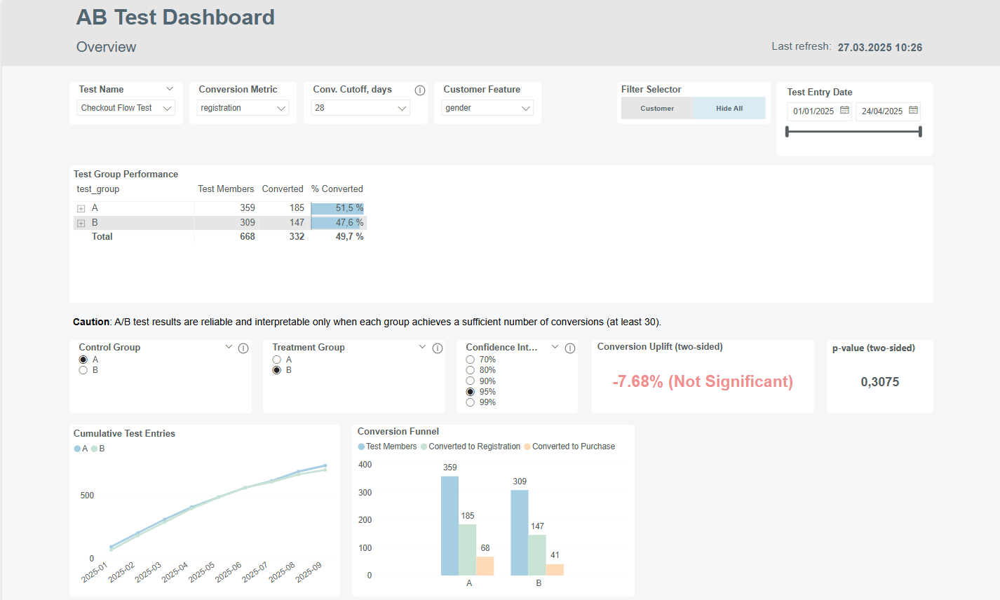
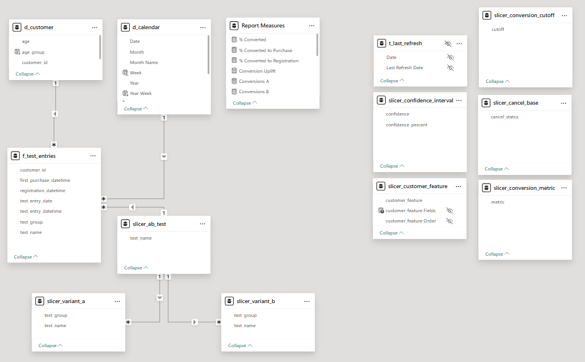
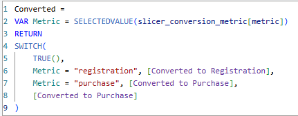

# AB Test Report
Own Power BI report for self-service A/B test analysis with test data generated by Python

# Technologies
- Power BI
- Python (prepare test data)

# Features
- Analyze any A/B test in the dataset based on a selected conversion metric and conversion cutoff (dynamic measures)
- Drill down to split analysis based on customer feature (field parameter)
- Detect statistical significance for various test scenarios (A/B/n tests supported), adjust confidence interval
- Hide/unhide additional slicers via bookmark
- Allow report readers to personalize visuals to their liking
- Lookup table with customer data to support operational analyses
- Data transformations in Power Query and DAX

# Prompt for Python script
> I would like to generate a test dataset for a A/B test analysis Power BI Report. I imagine star schema like this: 
> - fact table: f_test_entries (customer_id, test_entry_datetime, test_name, test_group, registration_datetime) 
> - dimension table: d_customer (customer_id, age, gender)
> 
> Notes:
> 1) registration_datetime & first_purchase_datetime can be only after test entry datetime and first_purchase_datetime is always after registration_datetime . About 60% of users register and 20% make a purchase.
> 2) each customer can only enter a given test once, but they can enter multiple tests
> 
> I need to generate these tables as CSV files that will feed into this report. Please set 1000 customers and 2000 test entries. Please prepare a Jyputer notebook script that I can enter into Google Colab and export as CSV.

# Screenshots
Power BI report front page with key tables and visuals:

Data model as a star schema:
- f_test_entries: fact table
- d_customer and d_calendar: dimension tables
- slicer_% tables: helper tables and field parameters that filter dynamic measures

Example of a dynamic measure: users can switch between conversions to registration or purchase using a slicer:

